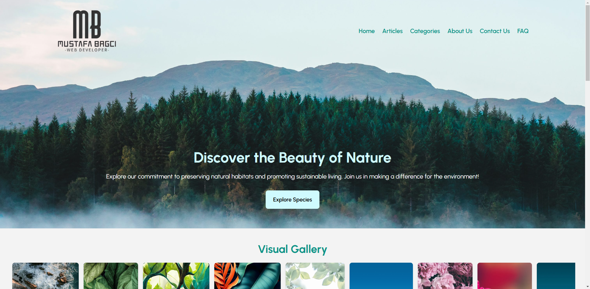

# Educational Website

Welcome to the repository for the **Educational Website** built with Next.js! This project is designed to provide an interactive and user-friendly platform for learning and education. Whether you're a developer, educator, or learner, this website aims to deliver a seamless experience.



## Features

- **Responsive Design**: Built with modern web standards to ensure compatibility across all devices.
- **Dynamic Routing**: Leverages Next.js's file-based routing for seamless navigation.
- **Interactive Content**: Supports quizzes, tutorials, and other educational materials.
- **SEO Optimization**: Utilizes Next.js's built-in SEO features for better search engine visibility.

## Technologies Used

- **Next.js**: A React framework for server-side rendering and static site generation.
- **React**: A JavaScript library for building user interfaces.
- **Tailwind CSS**: (Optional) A utility-first CSS framework for styling.
- **Node.js**: Backend runtime environment.
- **Vercel**: Deployment platform for Next.js applications.

## Getting Started

Follow these steps to set up the project locally on your machine.

### Prerequisites

- Node.js (v16 or higher)
- npm or yarn
- Git

### Installation

1. **Clone the repository**:
   ```bash
   git clone https://github.com/Mustafa-Bagci/educational-website-nextjs.git
   cd educational-website-nextjs
   ```

2. **Install dependencies**:
   ```bash
   npm install
   # or
   yarn install
   ```

3. **Set up environment variables**:
   Create a `.env.local` file in the root directory and add your environment variables:
   ```env
   NEXT_PUBLIC_API_KEY=your_api_key_here
   DATABASE_URL=your_database_url_here
   ```

4. **Run the development server**:
   ```bash
   npm run dev
   # or
   yarn dev
   ```

5. **Open your browser**:
   Visit `http://localhost:3000` to view the website.

### Deployment

This project is optimized for deployment on **Vercel**. To deploy:

1. Push your code to a GitHub repository.
2. Connect the repository to Vercel.
3. Vercel will automatically build and deploy your Next.js app.

Alternatively, you can deploy to other platforms like Netlify or Heroku.

## Project Structure

Here’s an overview of the project structure:

```
educational-website-nextjs/
├── components/       # Reusable React components
├── pages/            # Next.js pages and routing
├── public/           # Static assets (images, fonts, etc.)
├── styles/           # Global and component-specific styles
├── utils/            # Utility functions and helpers
├── .env.local        # Environment variables
├── next.config.js    # Next.js configuration
├── package.json      # Project dependencies
└── README.md         # Project documentation
```

## Contributing

Contributions are welcome! If you'd like to contribute, please follow these steps:

1. Fork the repository.
2. Create a new branch for your feature or bugfix.
3. Commit your changes.
4. Push your branch and open a pull request.

Please ensure your code follows the project's coding standards and includes appropriate tests.

## Acknowledgments

- [Next.js Documentation](https://nextjs.org/docs)
- [React Documentation](https://reactjs.org/docs/getting-started.html)
